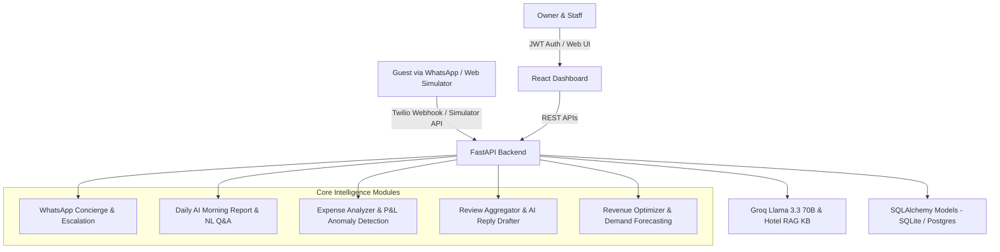

# 🏨 Remedra Hotels and Residences — Hotel Guest Experience & Management Platform (v2)

> A unified, full-stack intelligence and operations system for a 70-room independent boutique hotel and residences. Integrates a guest-facing WhatsApp AI Concierge with a comprehensive Owner & Staff Operations Suite.

---

## 🌟 Key Capabilities & Modules

1. **Guest WhatsApp Concierge (Phase 2 & 3)**
   - Powered by **Groq Llama 3.3 70B** with a rich Hotel RAG Knowledge Base.
   - Live **Twilio WhatsApp Webhook** (`/webhook/whatsapp`) + built-in interactive **WhatsApp Phone Simulator**.
   - Automatic intent classification (`FAQ`, `In-stay Request`, `Booking`, `Complaint`).
   - Sentiment analysis (-1.0 to 1.0) and real-time keyword/sentiment **Urgent Escalation Engine**.
   - Two-way staff reply-through from dashboard to WhatsApp.

2. **70-Room Interactive Matrix (Phase 4)**
   - Real-time room status grid across 7 floors (Clean, Occupied, Dirty Turnaround, Maintenance).
   - Filter by floor, status, or room category (Standard, Deluxe, Executive, Suite).
   - 1-click status modifier and housekeeping note logs.

3. **Daily AI Morning Report & "Ask Your Data" Q&A (Phase 5)**
   - Scheduled daily executive brief with occupancy breakdown, revenue metrics, housekeeping queue, sentiment index, and tactical strategic action.
   - Natural-Language Q&A engine: Translates business queries (e.g. *"Why is Tuesday low?"*, *"Which OTA is most profitable?"*) into structured data breakdowns and plain-English operational reasoning.

4. **Expense Analyzer & P&L Anomaly Detection (Phase 6)**
   - Bill/invoice ingestion with OCR parsing and extraction confidence scoring.
   - Monthly P&L statement: Room + F&B + Other revenue vs 7 categorized expenses = Net Operating Income.
   - Anomaly detection: automatically flags Month-over-Month cost surges (>15% variance).

5. **Review Manager & AI Response Hub (Phase 7)**
   - Multi-platform aggregator (Google, Booking.com, MakeMyTrip, Agoda, TripAdvisor).
   - Complaint and praise clustering (Cleanliness, Staff, Breakfast, Wi-Fi, Noise).
   - Context-aware AI response generator referencing specific guest remarks.

6. **Revenue Optimizer & Dynamic Pricing (Phase 8)**
   - 14-day forward demand forecasting model factoring in day-of-week demand, confirmed bookings, and lead-time pickup.
   - Dynamic rate delta recommendations (+₹900 surge, -₹500 midweek incentive) with clear economic reasoning.
   - 1-click rate matrix execution.

---

## 🏗️ Architecture



---

## 🚀 Quick Start Guide

### 1. Prerequisites
- Python 3.10+
- Node.js 18+

### 2. Backend Setup
```bash
# In the project root:
python -m pip install -r backend/requirements.txt

# Start FastAPI server on port 8000
python -m uvicorn backend.main:app --host 127.0.0.1 --port 8000 --reload
```
*The database (`hotel.db`) will be automatically created and seeded with 70 rooms, sample reservations, reviews, 6-month expenses, and dynamic rate forecasts.*

### 3. Frontend Setup
```bash
cd frontend
npm install
npm run dev
```
Open `http://localhost:5173` in your browser.

---

## 🔑 Demo Credentials
| Role | Email | Password |
| :--- | :--- | :--- |
| **Owner** | `owner@grandheritage.com` | `heritage2026` |
| **General Manager** | `manager@grandheritage.com` | `heritage2026` |
| **Front Desk** | `frontdesk@grandheritage.com` | `heritage2026` |

---

## 🧪 Automated Testing
Run the backend test suite:
```bash
python -m pytest backend/tests/test_api.py -v
```

See [EXPLANATION.md](file:///c:/Users/sajal/Documents/hotel/EXPLANATION.md) for architectural deep-dives into the agentic reasoning and dynamic yield algorithms.
